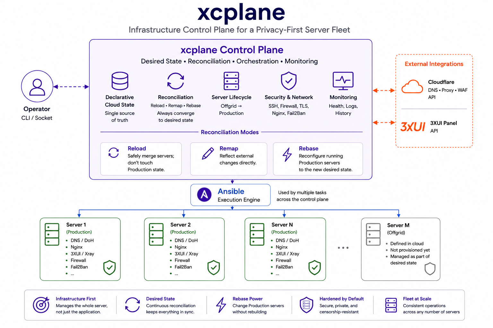

# xcplane

**xcplane is an infrastructure control plane for privacy-oriented Linux server
fleets.**  It provisions, secures, monitors, and continuously reconciles the
group of servers that run privacy services.

Instead of focusing on managing privacy apps/tools, xcplane manages the
infrastructure around them.

## Features

**xcplane brings desired-state infrastructure management into play.** A server is
not finished when Xray or DoH starts. xcplane manages the machine and its place
in the fleet — DNS, TLS, firewall, SSH, Nginx, Fail2Ban, privacy services, and
operational state.

When the desired state changes, xcplane can reconcile an existing Production
fleet with the new desired state **instead of rebuilding it**. This enhances
the privacy of the servers much further, because they are maintained in a fluid
state.

And all of this is because in xcplane infrastructure is treated as desired
state, **not a one-time installation**:

| Capability                              | Implementation in xcplane                                                                |
| --------------------------------------- | ---------------------------------------------------------------------------------------- |
| **Declarative fleet management**        | Entire cloud defined as desired state in a configuration file                            |
| **Server lifecycle & provisioning**     | **Offgrid → Production** through automated full-server deployment                        |
| **Infrastructure & privacy security**   | Hardening, private DoH, obfuscation, connection proxying, outbound restrictions          |
| **Controlled reconciliation**           | **Reload · Remap · Rebase**, from accepting changes to forcefully reconciling Production |
| **In-place production reconfiguration** | **Rebase** changes running servers without rebuilding/reinstalling them                  |
| **Integrated infrastructure state**     | DNS, Cloudflare proxy/rules, application-panel state, and external resources             |
| **Fleet-wide monitoring**               | Service health, history, aggregation, and operational workers                            |
| **Self-healing operations**             | Automated corrective actions when managed services deviate from expected state           |
| **Automatic cloud snapshots**           | DB and cloud configuration backed up during reconciliation                               |
| **Controller portability**              | Cloud state can be reconstructed from the database on another controller                 |

[3XUI](https://github.com/MHSanaei/3x-ui/) is currently the application-panel integration; the infrastructure model remains independent of it.

## Architecture
 

Reload accepts desired changes without touching Production specifications · Remap reflects external changes in the cloud model · Rebase forcefully reconciles Production servers with the new desired state.

## Requirements

### Controller
- Linux, any flavor
- Cargo, Rust >= 1.80 for compiling xcplane from source
- SQLite 3 dev/libs
- [Xray](https://github.com/XTLS/Xray-core/releases/) >= 26
- [Ansible](https://docs.ansible.com/projects/ansible/latest/installation_guide/intro_installation.html) >= core 2.19.0
- Cloudflare token with permission to edit DNS in Zone, edit Account Rulesets in Account, and edit Account Filter Lists in Account

### Managed servers
- Ubuntu 24.04+
- systemd
- SSH access
- public IP (v4 and/or v6)
- a domain that is managed or protected by Cloudflare

## Building from source

Clone the repository and issue:
```
cargo build -r
```
The standalone binary will be built in `./target/release/`

## Quick start

The quick start video demonstrates adding Offgrid servers, expanding the cloud into
Production, and reconciling several configuration changes.


For the written procedure, see [Getting Started](docs/getting-started.md).

## Documentation

- [Getting Started](docs/getting-started.md)
- [Architecture](docs/architecture.md)
- [Configuration](docs/configuration.md)
- [Server Lifecycle](docs/server-lifecycle.md)
- [Reconciliation](docs/reconciliation.md)
- [Rebase](docs/rebase.md)
- [Daemon](docs/daemon.md)
- [Backup/Restore](docs/db-backup-restore.md)
- [Networking and Security](docs/network-security.md)
- [Cloudflare](docs/cloudflare.md)
- [Application Panels](docs/panels/README.md)
- [Ansible](docs/ansible.md)
- [Corrective Actions](docs/corrective-actions.md)

## Security

See [SECURITY.md](SECURITY.md) for reporting security vulnerabilities.

## License

GPL-3.0-or-later.
